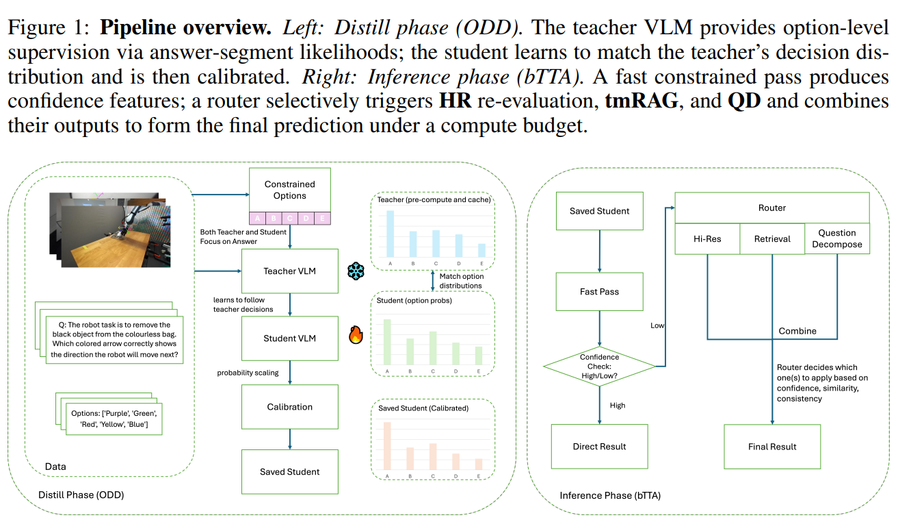

# BOLT: Decision‑Aligned Distillation and Budget-Aware Routing for Constrained Multimodal QA on Robots

**BOLT** is a decision-centric framework for constrained (multi-choice) multimodal QA on robots.
It combines **Option-level Decision Distillation (ODD)** during training and **Budget-aware Test-time Augmentation (bTTA)** during inference.

<p align="center">
  
</p>

## Get Started

### Installation

```bash
pip install -r requirements.txt
```

### Running

Below is a minimal end-to-end workflow (see each script's `--help` for full options).

- `scripts/build_teacher_cache.py`  
  Build the **teacher option-distribution cache** (answer-segment likelihood → option softmax), used for ODD training.

- `scripts/train_student_odd.py`  
  Train the **student** with **ODD** (KL to teacher option distribution + a small CE anchor).

- `scripts/evaluate.py`  
  Run **bTTA inference** (pass-1 + budget-aware routing over HR / tmRAG / QD) and report metrics.


## Citation

```bibtex
@inproceedings{
ni2026bolt,
title={{BOLT}: Decision\nobreakdash-Aligned Distillation and Budget-Aware Routing for Constrained Multimodal {QA} on Robots},
author={Tengjun Ni and Xin Yuan and Shenghong Li and Kai Wu and Ren Ping Liu and Wei Ni and Wenjie Zhang},
booktitle={The Fourteenth International Conference on Learning Representations},
year={2026},
url={https://openreview.net/forum?id=Vsy3nAnaX6}
}
```
